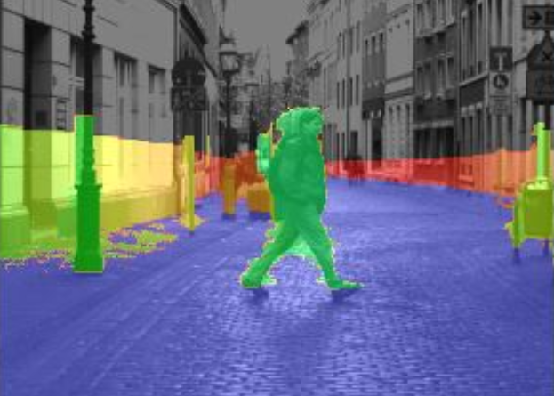
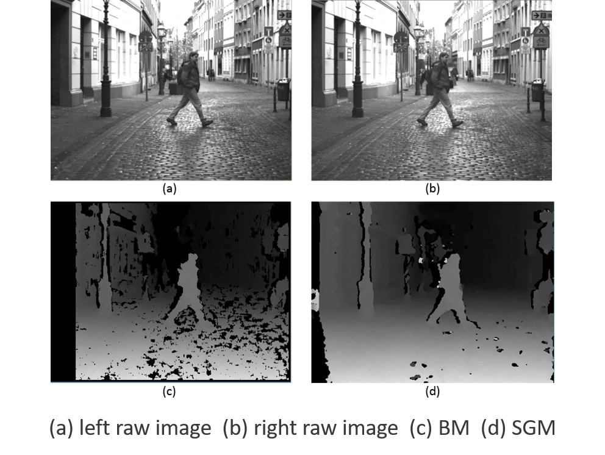
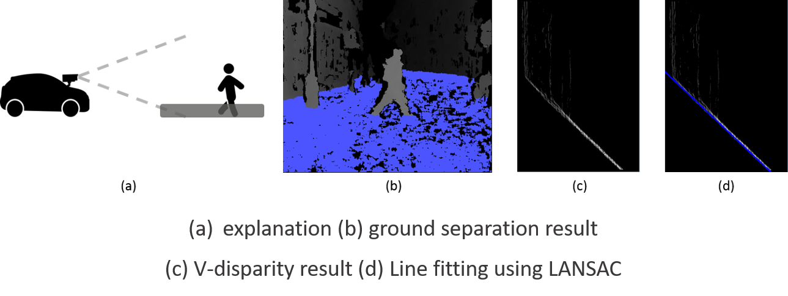
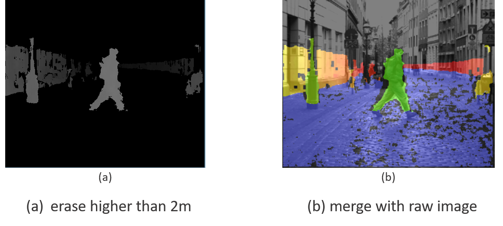
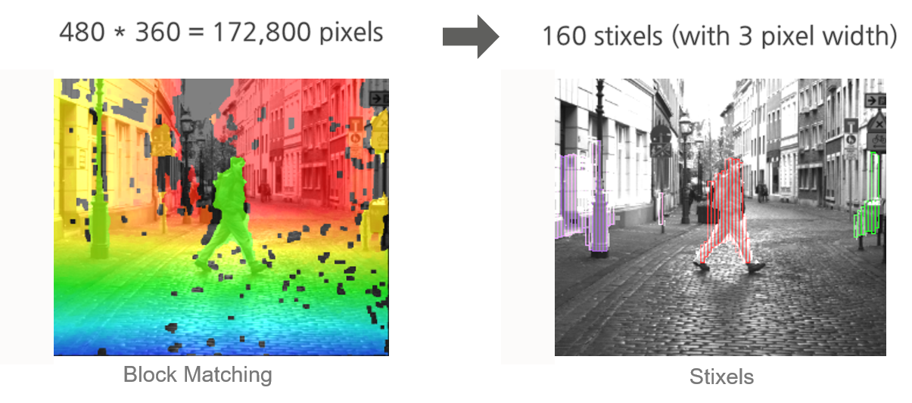

# Stereo Vision  
  
  

     

  
  
## Introduction  
  
  
>This project was coded in 2015 for self-driving project using stereo vision. I had conducted self-driving based on stereo vision. This code doesn't include detection & tracking. In this code, My point was preprocessing for exact obstacle detection.

## Summary  
  
  
* I used **Block Matching**(BM) Algorithm for a disparity map. 
* I separated ground and unnecessary parts(above the height of a vehicle) by using **v-disparity** method.
* I coded **occupancy grid** which is one of the General Object Detection(GOD) methods.
* I tried **stixels** method.

## Installation & Environment  
 
### Installation
 
* __Dataset__  
 
    [Daimler open dataset](https://drive.google.com/open?id=0B2XnTE8P37k9ak1va3JtWkZQN2s)
 
  
### Environment  
  
#### software  
  
>Windows 8.1(x64), Visual studio 2013, OpenCV 2.4.9  
 
#### hardware  
  
>CPU : i3-4005U 1.72GHz, Memory : 6GB

## Stereo matching Algorithm  
  

     

I used Block Matching(BM) Algorithm in this project. but you can use (Semi-Global Matching)SGM Algorithm by changing `alg = 0 to 1`.  As you can see, the SGM prints out better disparity map but I used a BM because of real-time processing. If your machine is good enough, I recommend SGM.

## Separate ground (searching free space)  
  

     

I separated ground using V-disparity. And I used RANSAC algorithm for line fitting. I had tried separating ground with geometric method previously, but v-disparity result is better.  
  
  
For more details about V-disparity, check this [paper](http://perso.lcpc.fr/tarel.jean-philippe/publis/jpt-iv02.pdf) (Real Time Obstacle Detection in Stereovision on
Non Flat Road Geometry Through ”V-disparity”Representation).  
   
  
## Except unnecessary parts (above the height of a vehicle)  
    

     

  
I also erased unnecessary parts(above the height of a vehicle) in the same way as V-disparity.  
  
  
## Occupancy grid (top view)  
  

     

This is a occupancy grid whis is one of the General Object Detection(GOD) methods.  
Red color means `ground`, Yellow means `obstacles within 13m`, Blue means `obstacles over 13m`  
  
  
## Stixels 
  

     

I also tried Stixels methods simply. This method is proposed from Daimler group.
For more details, check this [paper](http://www.lelaps.de/papers/badino_dagm09.pdf)(The Stixel World - A Compact Medium Level Representation of the 3D-World).  
  
  
## Result  
  
  
> video result (Click for full video)  
  
  

